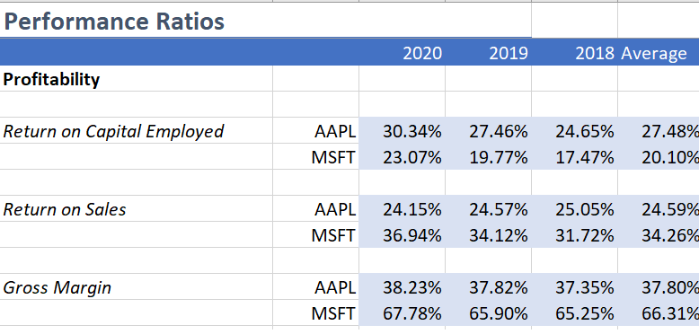
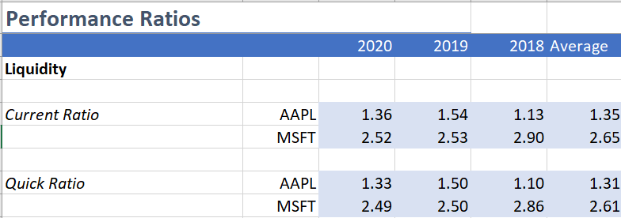
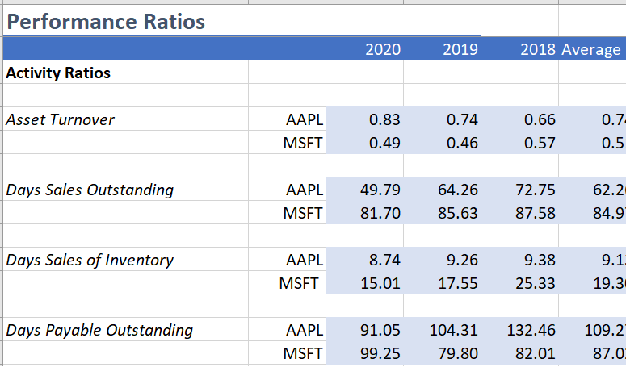
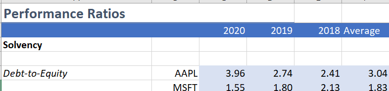

# Calculating Financial Performance Ratios
In this repository I use simple excel formulas to calculate the performance ratios for **AAPL** and **MSFT** for the past three fiscal years. The financial statements were manually downloaded from [investing.com](https://www.investing.com/)
## Profitability Ratios
Profitability ratios are financial metrics that help to measure a company's ability to generate profits, or value for shareholders. These ratios can be used to compare the historic performance of a single company, or to compare the the performance of similar companies. For further reading, refer to this [link](https://www.investopedia.com/terms/p/profitabilityratios.asp)

* *Return on Capital Employed:* Measures a company's profitability in terms of its capital. 

        ROI = Operating Income / Total Assest - Current Liabilities

* *Return on Sales:* Measures how efficiently a company turns sales into profits

        ROS  = Operating Income / Revenue

* *Gross Margin:* Represents the percentage of revenue the company retains after accounting for `COGS`

        Gross Margin = GrossProfit / Revenue 

## Liquidity Ratios
[Liquidity ratios](https://www.investopedia.com/terms/l/liquidityratios.asp) are financial instruments that help to measure a company's ability to pay off outstanding debt obligations without having to raise external capital. 

* *Current Ratio:* Measures the company's ability to pay off immediate debt obligations or those that will mature within a year. 

                Current ratio = Current Assets / Current Liabilities

* *Quick Ratio:* Measures the company's ability to cover short term obligations. Unlike current ratio, quick ratio does not take inventory into cosideration as part of the current assets because, in theory, inventory can take a long time to convert into cash. 
                Quick ratio = (Current Assets - Inventory) / Current Liabilities

## Activity Ratios(Efficiency Ratios)
Activity ratios measures the efficiency of a company's inventory, or asset, management to generate revenue

* *Asset Turnover:* Measures how efficient a company uses its assets to generate revenue.
                Asset turnover = Net Sales / Average Total Assets

* *Days Sales Outstanding:* Measures the average number of days it takes a company to collect money from credit sales.   

                DSO = (Account Receivable / Net Credit Sales) * 365

* *Days Sales of Inventory:* Measures the average number of days a company carries inventory before it generates a sale. 
        
                DSI = (Inventory / COGS) * 365

* *Days Payable Outstanding:* Measures the average number of days a company takes to pay off invoices and bills. 

                DPO = (Accounts Payable / COGS) * 365

## Solvency Ratios
Solvency Ratios help to evaluate how well a company's cash flow can cover its long term debts and obligations. 

* *Debt-to-Equity:* Helps to measure how a company is able to fund its operations through fully owned capital resources versus debt capital

                DE = Total Liabilities / Total Shareholders' Equity

